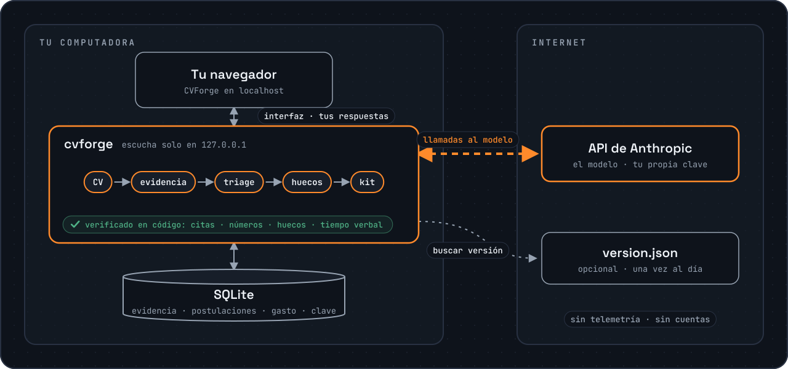

<!-- markdownlint-disable MD033 MD041 -->
<div align="center">



<p>
  <a href="https://github.com/gdberysan/cvforge/releases/latest"></a>
  <a href="https://github.com/gdberysan/cvforge/actions/workflows/ci.yml"></a>
  <a href="LICENSE"></a>
  
</p>

**CVs, cartas y respuestas de filtro a la medida, donde cada afirmación cita
algo que de verdad hiciste.**<br>
Corre en tu computadora con tu propia clave de Anthropic. Sin cuentas, sin
telemetría, sin nube. Y antes de escribir una palabra, te dice si vale la pena
postularte a una vacante.

**[Prueba la demo en vivo](https://cvforge.korven.dev)**: datos de ejemplo, sin clave, sin instalar nada.

[Instalar](#instalar) · [Cómo funciona](#cómo-funciona) · [Funciones](#funciones) · [Privacidad](#privacidad) · [Costo](#cuánto-cuesta) · [Limitaciones](#limitaciones-conocidas) · [Preguntas](#preguntas-frecuentes) · **[English](README.md)**


</div>

---

## Por qué

A las herramientas de escritura con IA les encanta hacerte sonar
impresionante. El problema es que quien recluta lee el resultado como un
hecho, y en la entrevista te van a preguntar por él. Un CV que afirma una
métrica que nunca alcanzaste, o una herramienta que nunca usaste, es peor que
uno sencillo.

CVForge está hecho al revés. Parte de la **evidencia** (qué hiciste, cuándo,
dónde, con qué números) y cada frase que genera tiene que citarla. Los números
se comprueban en código, no preguntándole a un modelo. Lo que no se puede
verificar se marca, nunca se esconde.

## Instalar

Descarga el archivo para tu sistema desde
[Releases](https://github.com/gdberysan/cvforge/releases/latest) y compruébalo
contra `checksums.txt`. Descomprímelo y luego:

| Sistema | Arrancar |
|---|---|
| **macOS** (Apple Silicon o Intel) | doble clic en **CVForge** |
| **Windows** | doble clic en **CVForge (Windows)** |
| **Linux** | `./programa/start.sh` (necesita Node.js 20+) |

Se abre en tu navegador en `http://localhost:3000`. En macOS y Windows el
runtime de Node viene dentro de la carpeta, así que no se instala nada en tu
sistema. La primera pantalla te pide tu
[clave de API de Anthropic](https://console.anthropic.com) y te guía para
conseguirla.

> **¿macOS dice que CVForge no se puede abrir?** La app todavía no está
> notarizada por Apple. En macOS 15 o más nuevo: cierra el aviso, abre
> **Ajustes del Sistema → Privacidad y seguridad**, baja hasta el mensaje
> sobre CVForge y pulsa **Abrir de todos modos**. En macOS 14 o anterior, clic
> derecho sobre CVForge → **Abrir** → **Abrir**. Solo la primera vez.

Para cerrarlo, usa el **botón de apagar** dentro de la app. Tu trabajo se
guarda solo a cada paso.

### Desde el código

```bash
git clone https://github.com/gdberysan/cvforge.git
cd cvforge
npm ci
npm run dev
```

Necesita Node.js 20+. La base de datos va a `./data/cvforge.db`.

## Cómo funciona



1. **Cargas tu carrera una vez.** Arrastra tu CV en PDF (en LinkedIn: *Más →
   Guardar como PDF*). CVForge lee puestos, fechas y logros, y luego te
   entrevista brevemente por cada puesto para recuperar lo que el CV dejó
   fuera.
2. **Pegas una vacante.** En unos veinte segundos tienes un veredicto con lo
   que tienes, lo que no, y qué requisito sería una suposición.
3. **Rellenas los huecos que sí son tuyos.** Cuando una vacante pide algo que
   hiciste pero nunca registraste, lo describes en unas frases y se vuelve
   evidencia para todas las postulaciones que sigan. Lo que dejes en blanco se
   queda en blanco: esa es la respuesta honesta y no cuesta nada.
4. **Generas el kit.** CV, carta, respuestas de filtro y mensaje al
   reclutador, en español de México o en inglés. Exporta a PDF o Word.
5. **Sigues lo que pasa.** Registras respuestas, entrevistas y rechazos, y ves
   qué tipo de vacantes sí contestan.

## Funciones

- **Cada afirmación cita evidencia.** Cada punto del CV y cada frase de la
  carta lleva los ids de los registros de los que salió, así que puedes
  revisar cualquier línea.
- **Números verificados en código.** Una cifra del resultado tiene que
  coincidir en valor con una cifra de tus registros: «1.8%» no puede volverse
  «18%», y «$12 mil» no puede volverse «$12M».
- **Los huecos no se maquillan.** Un requisito que el análisis marcó como
  faltante no puede aparecer como logro en el CV.
- **Un veredicto honesto.** *Descartar* se reserva para lo que ninguna
  reescritura arregla: un requisito de ubicación, zona horaria o permiso de
  trabajo que no cumples. Todo lo demás es cuestión de grado.
- **Revisión de exageraciones.** Una última pasada compara cada afirmación con
  la evidencia y sus fechas, incluido el tiempo verbal: un empleo que dejaste
  no se redacta como actual.
- **Suena menos a máquina.** Cartas y respuestas se revisan contra dos listas
  de muletillas de texto generado (la de español no es una traducción) y se
  reescriben solo si la reescritura sigue pasando todas las comprobaciones de
  arriba.
- **Gasto a la vista.** Cada llamada al modelo queda registrada con su costo.
- **Respaldos** de toda la base desde Ajustes, restaurables en un paso.
- Interfaz en **español e inglés**, y kits en cualquiera de los dos.

## Privacidad

- Sin cuentas, sin registro, sin nube, sin telemetría.
- Tu CV, tu evidencia, tus postulaciones y tu clave de API se quedan en tu
  computadora: una base SQLite y un `config.json` a su lado (permisos `0600`).
- El tráfico hacia fuera va a la **API de Anthropic**, donde corre el modelo,
  y, solo si lo activas en Ajustes, a una comprobación diaria de
  `cvforge.korven.dev/version.json` para avisarte de versiones nuevas. Nada
  más.
- El servidor escucha en `127.0.0.1` y no está pensado para exponerse a una
  red.

## Cuánto cuesta

CVForge es gratis. Pagas a Anthropic las llamadas al modelo, con tu propia
clave. Cifras aproximadas:

| Paso | Costo |
|---|---|
| Importar un CV | $0.05–0.20 USD, una vez |
| Analizar una vacante | $0.10–0.15 USD |
| Un kit completo (CV, carta, respuestas, mensaje) | unos $0.50 USD |

El total acumulado siempre está a la vista dentro de la app.

## Lo que no hace

- **No postula por ti**, no hace scraping de portales de empleo y no toca tu
  cuenta de LinkedIn. Te ayuda a decidir y a prepararte; enviar es cosa tuya.
- **No inventa.** Si tu evidencia no respalda un requisito, el kit no lo
  afirma, aunque eso deje el CV más flojo.
- **No funciona sin modelo.** Necesita una clave de Anthropic; no hay modo sin
  conexión ni con modelos locales.

## Limitaciones conocidas

- **Solo Anthropic.** Los prompts y los esquemas de salida están ajustados y
  evaluados con Claude; otros proveedores y modelos locales no están
  soportados.
- **El veredicto es un juicio, no una medición.** La misma vacante puede caer
  en un veredicto vecino en una segunda pasada. Las razones que lo acompañan
  son la parte que vale la pena leer.
- **Los proyectos personales todavía no se pueden citar.** Se leen del CV pero
  aún no son evidencia que un kit pueda citar; por ahora, el trabajo tiene que
  pertenecer a un puesto.
- **Windows no está probado en hardware real.** El lanzador existe pero
  todavía no se ha corrido en una máquina Windows física. Se agradecen
  reportes.
- **Apps sin firmar.** Ni la versión de macOS ni la de Windows están firmadas
  todavía (ver la nota en [Instalar](#instalar)).
- **El puerto 3000 es fijo en los lanzadores de macOS y Windows.** Si otra
  cosa lo usa, ciérrala primero; en Linux, `PORT=3001 ./programa/start.sh`.

## Preguntas frecuentes

**¿De verdad es gratis?** Sí, con licencia MIT. El único costo es tu propio
uso de Anthropic (ver [Cuánto cuesta](#cuánto-cuesta)).

**¿Por qué Anthropic y no OpenAI o un modelo local?** Las comprobaciones
dependen de salida estructurada y de un comportamiento evaluado contra
vacantes reales. Soportar otro modelo implica repetir esa evaluación, no solo
cambiar de SDK.

**¿Alguien ve mi CV?** La API de Anthropic lo procesa para correr el modelo.
No se envía nada a Korven ni a nadie más.

**¿Puede escribir un CV para un puesto para el que no califico?** Escribe la
versión más honesta de tu encaje, y el veredicto te dice que es un reto. No
afirma lo que no tienes.

**¿Cómo lo desinstalo?** Borra la carpeta. Tus datos están en `datos/` dentro
de ella; respáldala antes si quieres conservarlos.

## Configuración

| Variable | Por defecto | Para qué sirve |
|---|---|---|
| `PORT` | `3000` | Puerto del servidor. |
| `CVFORGE_DB_PATH` | `./data/cvforge.db` (app: `datos/cvforge.db`) | Base SQLite; `config.json` vive a su lado. |
| `CVFORGE_CONFIG_PATH` | junto a la base | Ubicación explícita de `config.json`. |
| `ANTHROPIC_API_KEY` | — | Clave por entorno; tiene prioridad sobre Ajustes. |
| `CVFORGE_MODE=demo` | — | Demo de solo lectura con una base en memoria sembrada desde `demo/seed.json`. |

## Contribuir y soporte

- Fallos e ideas: [GitHub Issues](https://github.com/gdberysan/cvforge/issues).
  **Nunca pegues un CV real** en un issue.
- ¿Vas a mandar código? Lee antes [`CONTRIBUTING.md`](CONTRIBUTING.md); dice
  qué encaja en el proyecto y qué no.
- ¿Un problema de seguridad? No abras un issue público; ver
  [`SECURITY.md`](SECURITY.md).
- [`CODE_OF_CONDUCT.md`](CODE_OF_CONDUCT.md) cubre cómo se trata a la gente
  aquí.

### Desarrollo

`npm run dev` arranca el servidor de desarrollo. Los gates son
`npm run typecheck`, `npm run lint` (Biome), `npm test` (Vitest) y
`npm run build`, que además revisa cada chunk del cliente en busca de una
clave de API. Las migraciones se aplican al abrir la base.
[`CLAUDE.md`](CLAUDE.md) lista las invariantes que no son obvias; léelo antes
de tocar un prompt o un esquema que vea el modelo.

Los tests simulan el modelo, así que no ven si la extracción empeora.
`npm run eval` vuelve a correr el análisis real sobre vacantes guardadas
(≈ $0.13 USD cada una, con tu clave). El conjunto de quien mantiene el repo es
privado porque contiene vacantes reales, así que `npm run eval:snapshot` arma
el tuyo; se corre antes de cualquier release que haya cambiado un prompt.

## Licencia y marca

Código con licencia **MIT**: ver [`LICENSE`](LICENSE) y [`NOTICE`](NOTICE).
Los nombres «CVForge» y «Korven», el wordmark, el emblema y el icono de la app
**no** están cubiertos por ella
([`assets/brand/LICENSE`](assets/brand/LICENSE)): si publicas un fork, usa tu
propio nombre y emblema.

Una obra de **[Korven](https://korven.dev)**.
