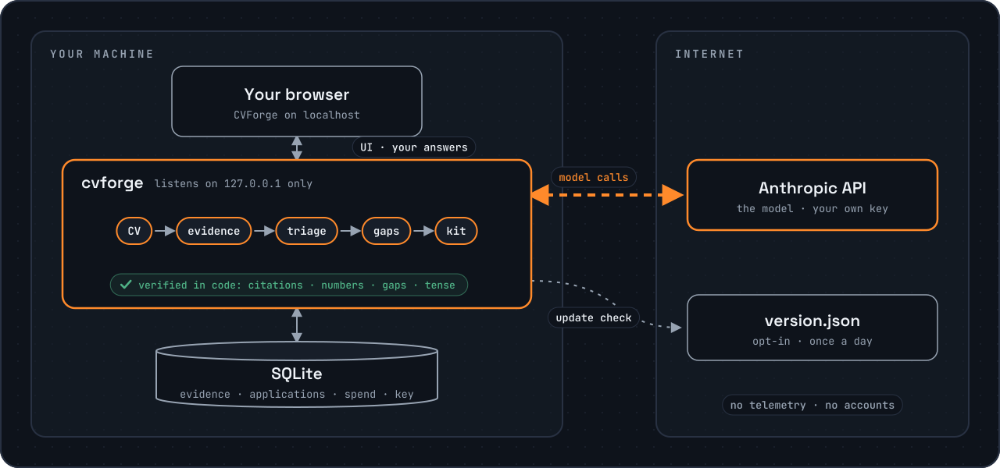

<!-- markdownlint-disable MD033 MD041 -->
<div align="center">



<p>
  <a href="https://github.com/gdberysan/cvforge/releases/latest"></a>
  <a href="https://github.com/gdberysan/cvforge/actions/workflows/ci.yml"></a>
  <a href="LICENSE"></a>
  
</p>

**Tailored CVs, cover letters and screening answers, where every claim cites
something you actually did.**<br>
Runs on your machine with your own Anthropic key. No accounts, no telemetry,
no cloud. And before you write a word, it tells you whether a posting is worth
applying to.

**[Try the live demo](https://cvforge.korven.dev)**: sample data, no key, nothing to install.

[Install](#install) · [How it works](#how-it-works) · [Features](#features) · [Privacy](#privacy) · [Cost](#what-it-costs) · [Limitations](#known-limitations) · [FAQ](#faq) · **[Español](README.es.md)**


</div>

---

## Why

AI writing tools are happy to make you sound impressive. The trouble is that a
recruiter reads the result as a statement of fact, and an interviewer will ask
about it. A CV that claims a metric you never hit, or a tool you never used,
is worse than a plain one.

CVForge is built the other way round. It starts from **evidence** (what you
did, when, where, with which numbers) and every sentence it generates has to
cite that evidence. Numbers are checked in code, not by asking a model. What
can't be verified is flagged, never hidden.

## Install

Download the archive for your system from
[Releases](https://github.com/gdberysan/cvforge/releases/latest) and check it
against `checksums.txt`. Unzip it, then:

| System | Start |
|---|---|
| **macOS** (Apple Silicon or Intel) | double-click **CVForge** |
| **Windows** | double-click **CVForge (Windows)** |
| **Linux** | `./programa/start.sh` (needs Node.js 20+) |

It opens in your browser at `http://localhost:3000`. On macOS and Windows the
Node runtime ships inside the folder, so nothing is installed on your system.
The first screen asks for your [Anthropic API key](https://console.anthropic.com)
and walks you through getting one.

> **macOS says CVForge can't be opened?** The app isn't notarized by Apple
> yet. On macOS 15 or newer: dismiss the notice, open **System Settings →
> Privacy & Security**, scroll to the message about CVForge and click **Open
> Anyway**. On macOS 14 or earlier, right-click CVForge → **Open** → **Open**.
> First launch only.

To quit, use the **power button** inside the app. Your work saves itself at
every step.

### From source

```bash
git clone https://github.com/gdberysan/cvforge.git
cd cvforge
npm ci
npm run dev
```

Needs Node.js 20+. The database goes to `./data/cvforge.db`.

## How it works



1. **Load your career once.** Drop your CV as a PDF (on LinkedIn: *More →
   Save to PDF*). CVForge reads roles, dates and achievements, then briefly
   interviews you role by role to recover what the CV left out.
2. **Paste a posting.** In about twenty seconds you get a verdict with what
   you have, what you don't, and which requirement would be a guess.
3. **Fill the gaps that are actually yours.** When a posting asks for
   something you did but never wrote down, you describe it in a few sentences
   and it becomes evidence for every application after. What you leave blank
   stays blank; that's the honest answer and it costs nothing.
4. **Generate the kit.** CV, cover letter, screening answers and a message to
   the recruiter, in Mexican Spanish or English. Export to PDF or Word.
5. **Track what happens.** Record replies, interviews and rejections, and see
   which kinds of postings actually answer.

## Features

- **Every claim cites evidence.** Each CV bullet and letter sentence carries
  the ids of the records it came from, so you can check any line.
- **Numbers verified in code.** A figure in the output must match a figure in
  your records as a value: "1.8%" can't become "18%", and "$12 mil" (twelve
  thousand, in Spanish) can't become "$12M".
- **Gaps can't be papered over.** A requirement the analysis marked as missing
  can't be claimed by a generated bullet.
- **An honest verdict.** *Skip* is reserved for what no rewriting can fix: a
  location, time-zone or work-permit requirement you don't meet. Everything
  else is a matter of degree.
- **Overstatement check.** A final pass compares each claim against the
  evidence and its dates, tense included: a job you left isn't written up as
  current.
- **Reads less like a machine.** Letters and answers are checked against two
  lists of machine-writing tells (the Spanish one isn't a translation) and
  rewritten only if the rewrite still passes every check above.
- **Spend you can see.** Every model call is recorded with its cost.
- **Backups** of the whole database from Settings, restorable in one step.
- **Spanish and English** interface, and kits in either language.

## Privacy

- No accounts, no sign-up, no cloud, no telemetry.
- Your CV, evidence, applications and API key stay on your machine: a SQLite
  database and a `config.json` beside it (`0600` permissions).
- Outside traffic goes to **Anthropic's API**, where the model runs, and,
  only if you turn it on in Settings, a once-a-day check of
  `cvforge.korven.dev/version.json` for new versions. Nothing else.
- The server binds to `127.0.0.1` and isn't meant to be exposed to a network.

## What it costs

CVForge is free. You pay Anthropic for the model calls, on your own key.
Rough figures:

| Step | Cost |
|---|---|
| Importing a CV | $0.05–0.20, once |
| Analysing a posting | $0.10–0.15 |
| A full kit (CV, letter, answers, message) | about $0.50 |

The running total is always visible inside the app.

## What it doesn't do

- **It doesn't apply for you**, scrape job boards, or touch your LinkedIn
  account. It helps you decide and prepare; sending is up to you.
- **It doesn't invent.** If your evidence doesn't support a requirement, the
  kit won't claim it, even when that makes the CV weaker.
- **It doesn't run without a model.** It needs an Anthropic key; there's no
  offline or local-model mode.

## Known limitations

- **Anthropic only.** Prompts and output schemas are tuned and evaluated
  against Claude; other providers and local models aren't supported.
- **The verdict is a judgement, not a measurement.** The same posting can land
  on a neighbouring verdict on a second run. The reasons listed under it are
  the part worth reading.
- **Side projects can't be cited yet.** They're read from your CV but aren't
  yet evidence a kit can cite; for now, work has to belong to a role.
- **Windows is untested on real hardware.** The launcher exists but hasn't
  been run on a physical Windows machine yet. Reports welcome.
- **Unsigned apps.** Neither the macOS nor the Windows build is signed yet
  (see the note under [Install](#install)).
- **Port 3000 is fixed in the macOS and Windows launchers.** If something else
  uses it, close that first; on Linux, `PORT=3001 ./programa/start.sh`.

## FAQ

**Is it really free?** Yes, MIT-licensed. The only cost is your own Anthropic
usage (see [What it costs](#what-it-costs)).

**Why Anthropic and not OpenAI or a local model?** The grounding checks depend
on structured output and on behaviour that's been evaluated against real
postings. Supporting another model means re-running that evaluation, not just
swapping an SDK.

**Does anyone see my CV?** Anthropic's API processes it to run the model.
Nothing is sent to Korven or anyone else.

**Can it write a CV for a job I'm not qualified for?** It writes the most
honest version of your fit, and the verdict tells you it's a stretch. It won't
claim what you don't have.

**How do I uninstall it?** Delete the folder. Your data is in `datos/` inside
it; back that up first if you want to keep it.

## Configuration

| Variable | Default | What it's for |
|---|---|---|
| `PORT` | `3000` | Server port. |
| `CVFORGE_DB_PATH` | `./data/cvforge.db` (app: `datos/cvforge.db`) | SQLite database; `config.json` lives beside it. |
| `CVFORGE_CONFIG_PATH` | beside the database | Explicit location of `config.json`. |
| `ANTHROPIC_API_KEY` | — | Key from the environment; takes precedence over Settings. |
| `CVFORGE_MODE=demo` | — | Read-only demo with an in-memory database seeded from `demo/seed.json`. |

## Contributing and support

- Bugs and ideas: [GitHub Issues](https://github.com/gdberysan/cvforge/issues).
  **Never paste a real CV** into an issue.
- Sending code? Read [`CONTRIBUTING.md`](CONTRIBUTING.md) first; it says what
  fits the project and what doesn't.
- Security issue? Don't open a public issue; see [`SECURITY.md`](SECURITY.md).
- [`CODE_OF_CONDUCT.md`](CODE_OF_CONDUCT.md) covers how people are treated
  here.

### Developing

`npm run dev` starts the dev server. The gates are `npm run typecheck`,
`npm run lint` (Biome), `npm test` (Vitest) and `npm run build`, which also
scans every client chunk for an API key. Migrations apply when the app opens
the database. [`CLAUDE.md`](CLAUDE.md) lists the non-obvious invariants; read
it before touching a prompt or a model-facing schema.

The tests mock the model, so they can't see extraction getting worse.
`npm run eval` re-runs live triage on snapshotted postings (≈ $0.13 each, on
your key). The maintainer's snapshot set is private because it holds real
postings, so `npm run eval:snapshot` builds your own; it runs before any
release that changed a prompt.

## License and brand

Code under the **MIT** license: see [`LICENSE`](LICENSE) and
[`NOTICE`](NOTICE). The "CVForge" and "Korven" names, wordmark, emblem and app
icon are **not** covered by it ([`assets/brand/LICENSE`](assets/brand/LICENSE)):
if you publish a fork, use your own name and emblem.

A work by **[Korven](https://korven.dev)**.
